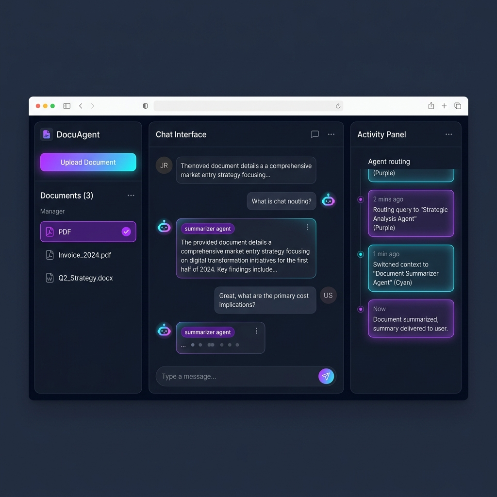
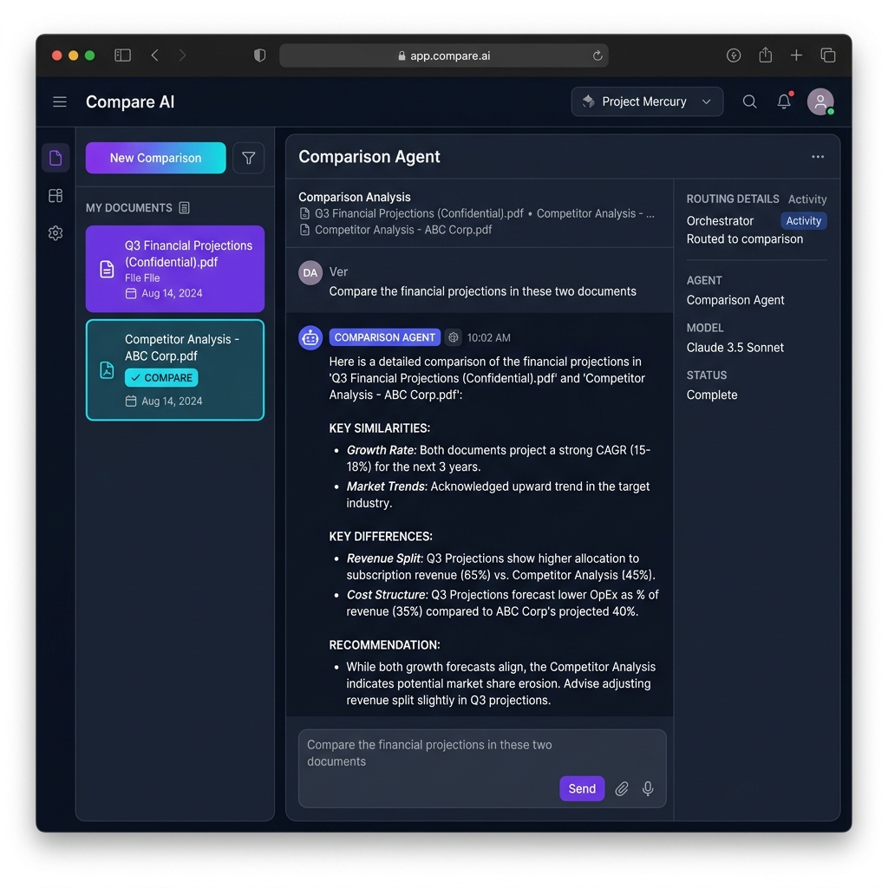
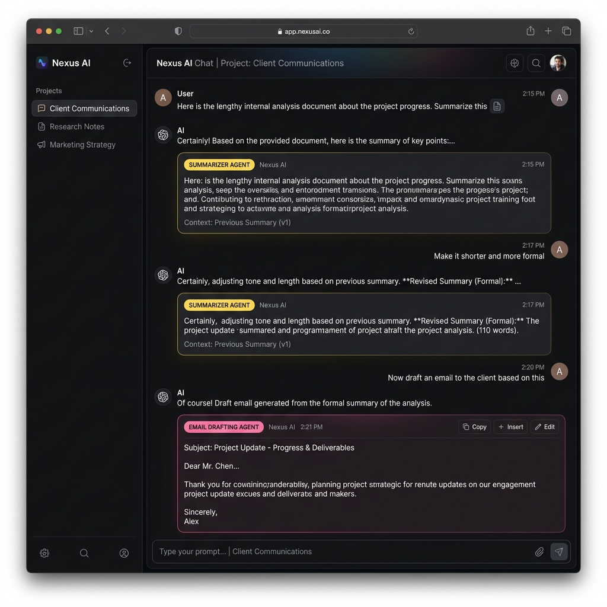
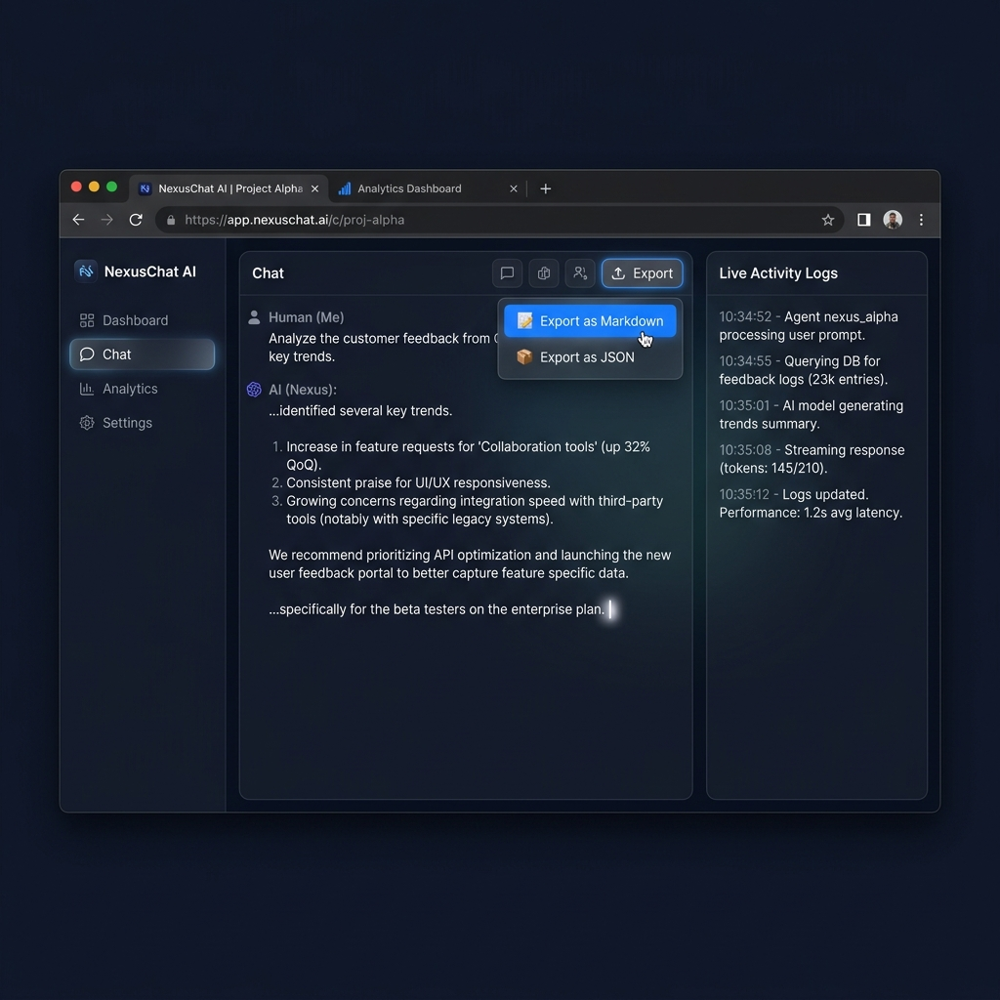

<div align="center">
  <div p="4" bg="gray-900" rounded="xl" shadow="2xl" border="1" border-color="gray-800" max-w="3xl" mx="auto">
    <h1 align="center" style="font-size: 3rem; margin-bottom: 10px;">🤖 DocuAgent System</h1>
    <p align="center" style="font-size: 1.2rem; color: #9CA3AF;">Multi-Agent AI Document Intelligence Platform</p>
  </div>
</div>

<div align="center" style="margin-top: 20px; margin-bottom: 40px;">
  <a href="https://github.com/sharma614/docuagent_system-/stargazers"></a>
  <a href="LICENSE"></a>
  <a href="https://python.org"></a>
  <a href="https://react.dev"></a>
  <a href="https://groq.com"></a>
</div>

<p align="center">
  <b>A production-ready, multi-agent AI system for intelligent document processing. Upload PDFs, DOCX, or TXT files and interact with them through 9 specialized AI agents — all powered by Groq and Pinecone.</b>
</p>

---

## 📸 Platform Capabilities

<table align="center" style="border-collapse: separate; border-spacing: 15px;">
  <tr>
    <td align="center" width="50%">
      
      <br />
      <b>Multi-Agent Orchestration</b>
      <p style="font-size: 12px; color: #9CA3AF;">Real-time routing logs with distinct agent badges</p>
    </td>
    <td align="center" width="50%">
      
      <br />
      <b>Document Comparison</b>
      <p style="font-size: 12px; color: #9CA3AF;">Compare similarities & differences across 2 files</p>
    </td>
  </tr>
  <tr>
    <td align="center" width="50%">
      
      <br />
      <b>Context-Aware Memory</b>
      <p style="font-size: 12px; color: #9CA3AF;">Intelligent follow-ups bridging multiple agents</p>
    </td>
    <td align="center" width="50%">
      
      <br />
      <b>Streaming & Export</b>
      <p style="font-size: 12px; color: #9CA3AF;">Live SSE streaming with Markdown/JSON export</p>
    </td>
  </tr>
</table>

---

## ✨ Features

- 📄 **Multi-document management** with per-document Pinecone namespaces
- 🧠 **9 specialized AI agents** orchestrated intelligently
- ⚡ **Real-time SSE streaming** for instant token generation
- 🧠 **Context-Aware Memory** for complex, multi-turn follow-ups
- 📊 **Agent Activity Log** — see exactly which agent handled your request and why
- 🆚 **Document Comparison** — side-by-side semantic comparison
- 📤 **Chat Export** — download conversations as Markdown or JSON
- 🌗 **Dark theme UI** with glassmorphism and animated streaming cursors

---

## 🤖 The 9 Agents

| Agent | Trigger | What it does |
|---|---|---|
| 🔀 **Orchestrator** | Every message | Routes to the correct agent using LLM reasoning |
| 📥 **Ingestion** | File upload | Parses PDF/DOCX/TXT, chunks, embeds & stores in Pinecone |
| 🔍 **Retrieval** | Search queries | Semantic vector search across documents |
| 💬 **QA** | Specific questions | Grounded answers from document context + history |
| 📝 **Summarizer** | "Summarize..." | Concise summary + key bullet points + history |
| 🌐 **Translator** | "Translate to..." | Detects source language, translates content |
| 📊 **Data Extract** | "Extract data..." | Returns structured JSON of tables, KV pairs, entities |
| ✉️ **Email Drafter** | "Draft an email..." | Professional email based on document context + history |
| 🆚 **Comparison** | "Compare these..." | Side-by-side analysis of two selected documents |

---

<details>
<summary><b>🛠️ View Architecture Diagram</b></summary>
<br>

```
┌─────────────────────────────────────────────┐
│                  Frontend                    │
│         React + Vite + Tailwind CSS          │
│   Sidebar │ Chat Interface │ Agent Activity  │
└─────────────────┬──────────────────────────┘
                  │ SSE Streaming (localhost:8000)
┌─────────────────▼──────────────────────────┐
│              FastAPI Backend                 │
│                                              │
│  ┌──────────────────────────────────────┐   │
│  │          Orchestrator Agent           │   │
│  │    (Groq Llama 3.3 70B — routing)    │   │
│  └──┬──────────────────────────────┬───┘   │
│     │                              │         │
│  ┌──▼───────┐  ┌──────────┐  ┌───▼──────┐  │
│  │   QA     │  │Summarizer│  │Translator│  │
│  │ Email    │  │Retrieval │  │DataExtract│  │
│  │ Compare  │  └────┬─────┘  └──────────┘  │
│  └──────────┘       │                        │
│                     │                        │
│  ┌──────────────────▼─────────────────────┐  │
│  │         Sentence Transformers           │  │
│  │        (all-MiniLM-L6-v2, 384-dim)     │  │
│  └──────────────────┬────────────────────┘  │
└─────────────────────┼─────────────────────┘
                      │
          ┌───────────▼──────────┐
          │   Pinecone (Vector DB) │
          │  Per-document namespaces│
          └──────────────────────┘
```
</details>

---

## 🚀 Quick Start Guide

### Prerequisites
- Python 3.10+
- Node.js 18+
- [Groq API key](https://console.groq.com) (free tier works perfectly)
- [Pinecone API key](https://app.pinecone.io) (free tier works perfectly)

### 1️⃣ Clone & Backend Setup
```bash
git clone https://github.com/sharma614/docuagent_system-.git
cd docuagent_system-

# Create virtual environment & activate
python -m venv venv
source venv/bin/activate  # Windows: .\venv\Scripts\activate

# Install backend dependencies
pip install -r backend/requirements.txt
```

### 2️⃣ Environment Variables
Copy `.env.example` to `.env` in the `backend` folder:
```env
GROQ_API_KEY=your_groq_api_key_here
PINECONE_API_KEY=your_pinecone_api_key_here
PINECONE_INDEX_NAME=default
PORT=8000
```
> The Pinecone index is automatically created on first run (384-dim, cosine metric).

### 3️⃣ Start Services
Terminal 1 (Backend):
```bash
python -m uvicorn backend.main:app --host 0.0.0.0 --port 8000 --reload
```
Terminal 2 (Frontend):
```bash
cd frontend
npm install
npm run dev
```

🌐 Open `http://localhost:5173` in your browser.

---

## 🔌 API Reference

| Method | Endpoint | Description |
|---|---|---|
| `GET` | `/health` | Check backend & API key status |
| `POST` | `/upload` | Upload & chunk a document file |
| `GET` | `/documents` | List all tracked documents (registry) |
| `DELETE`| `/documents/{id}`| Remove vectors from Pinecone & registry |
| `POST` | `/chat/stream` | Stream LLM tokens via Server-Sent Events |
| `POST` | `/export` | Download chat history (Markdown/JSON) |

---

<div align="center">
  <p>Built with ❤️ by <a href="https://github.com/sharma614">Pulkit Sharma</a></p>
  <p><i>Under MIT License</i></p>
</div>
